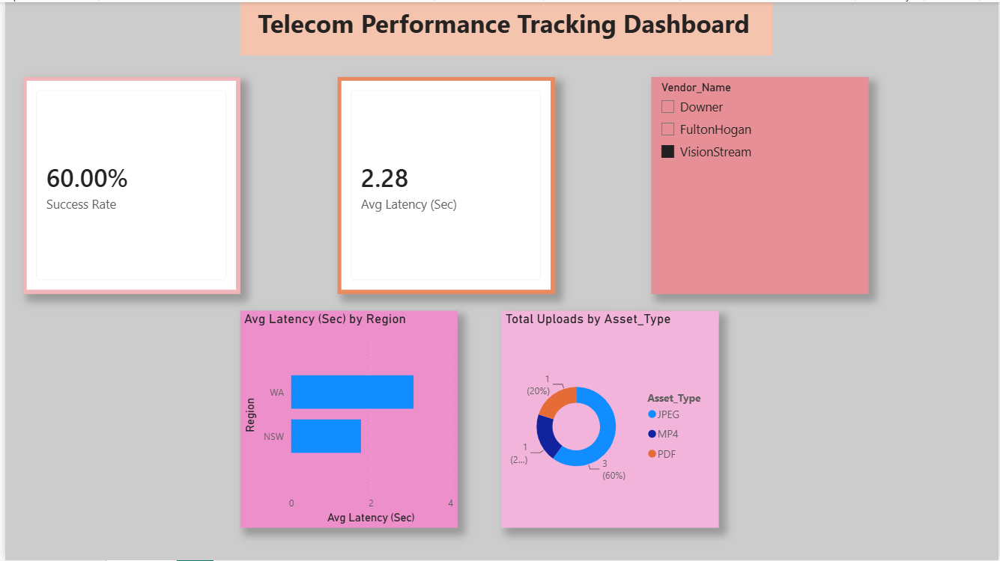

# Telecom Portal — Performance Tracking Dashboard

## Project Overview
An interactive Power BI dashboard analyzing data transaction health, upload latencies, and field compliance metrics for a National Broadband Network (NBN) telecom media capture portal.

## Dashboard Preview

## Key Technical Features Deployed
1) DAX KPI Logic: Developed measures tracking total transaction volumes, average regional upload latencies, and transaction success rates.
2) Interactive Data Exploration: Integrated dynamic cross-filtering using multi-select vendor and time slicers.
